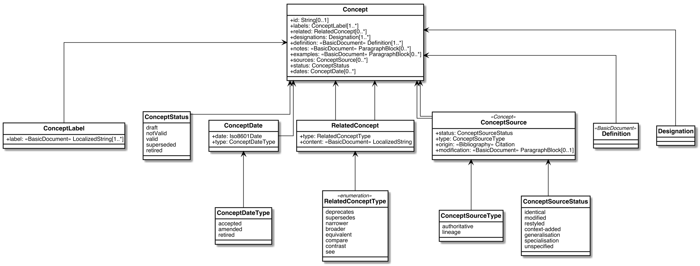
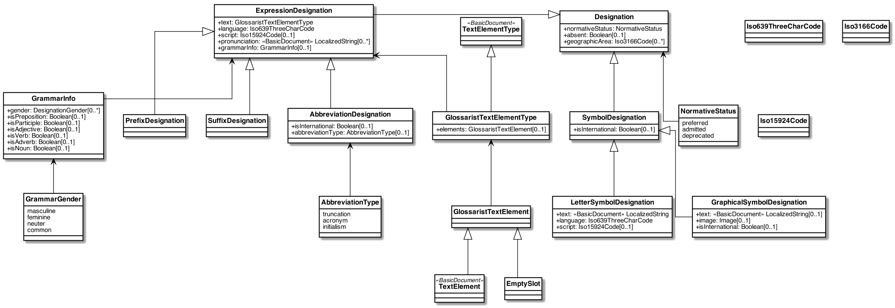
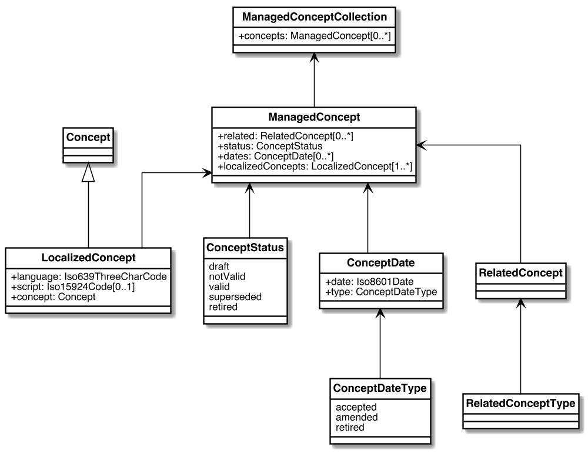

= Glossarist Concept/Term Models (ISO 10241-1)

== General

Glossarist `Concept` and `Designation` models are used in glossarist-supported
sites for RDF and JSON-LD generation.

These models align with ISO 10241-1 and the concept systems described in ISO 704.

== Concept-Term interaction cycle

image::images/concept-term-cycle.png[]

== Origin

Term modelled according to ISO 10241-1 and ISO/IEC Directives 2, 16.6:

* Multiple preferred terms
* Single definition
* Multiple notes
* Multiple admitted terms
* Multiple deprecated terms
* Multiple examples
* Single domain
* Multiple sources

Paragraph/TextElement may contain a formula.

Definition: Definition modelled according to ISO/IEC Directives 2, 17:

* Can be a symbol or abbreviation
* A DefinitionCollection is represented as a single clause

== UML Models

=== Concept

=== Designation

=== ManagedConcept and ManagedConceptCollection

