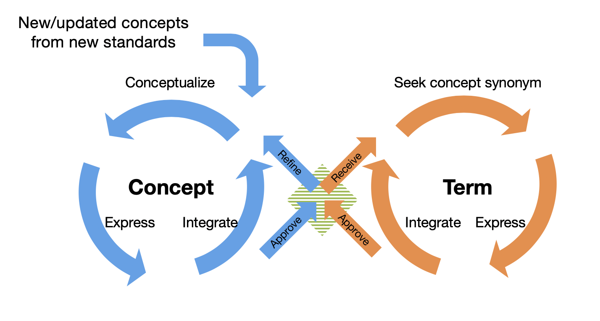
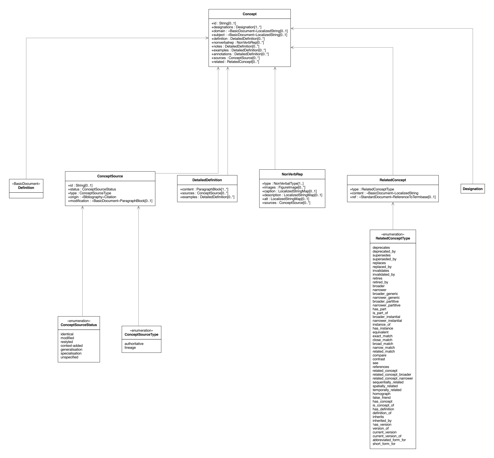
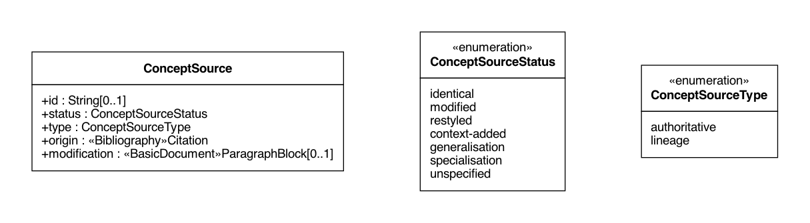
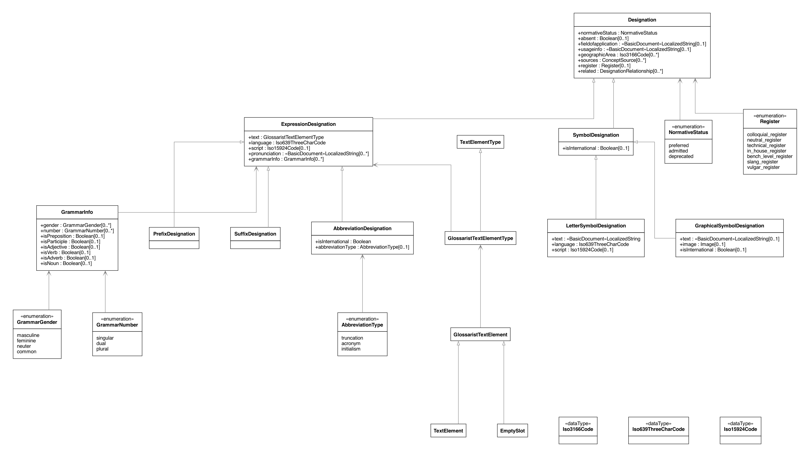
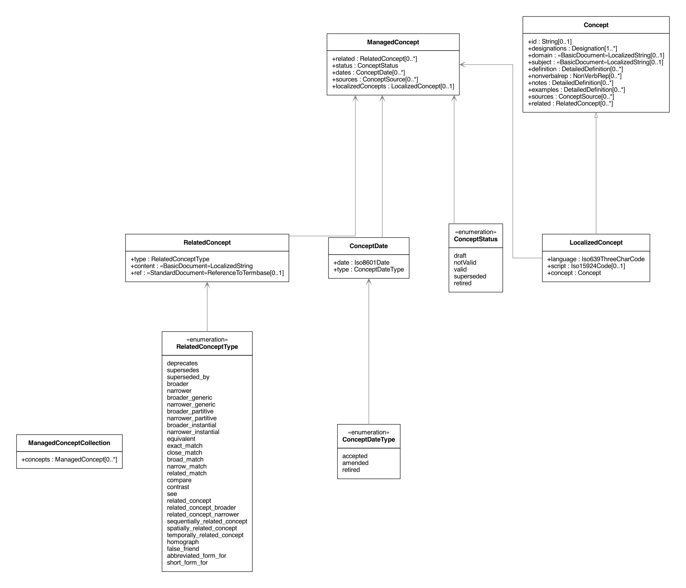

= Glossarist Concept/Term Models

== General

Glossarist `Concept` and `Designation` models are used in glossarist-supported
sites for RDF and JSON-LD generation.

These models align with multiple ISO standards for terminology management:

* **ISO 10241-1** — Terminology entries in standardized terminology
* **ISO 704** — Terminology work: principles and methods (concept systems)
* **ISO 30042 / TBX** — Terminology markup framework (data exchange)
* **ISO 12620** — Data category registry (term types, register, grammar)
* **ISO 25964 / SKOS** — Thesaurus interoperability (hierarchical and mapping relationships)
* **ISO 19135** — Geographic information — Procedures for item registration (register management, versioning)
* **ISO 639** — Language codes
* **ISO 15924** — Script codes
* **ISO 24229** — Conversion system codes

These models are meant to be fully compatible with the data in the IEC Electropedia.

== Concept-Term interaction cycle

== Origin

The Concept models support ISO 10241-1 and ISO/IEC Directives 2, 16.6.

In particular, the following features are supported.

* Multiple preferred terms
* Single definition
* Multiple notes
* Multiple admitted terms
* Multiple deprecated terms
* Multiple examples
* Single domain (per localized concept)
* Multiple domains (concept-level `ConceptReference` collection)
* Multiple tags (concept-level organizational labels, not rendered as domains)
* Multiple sources (with optional `id` for inline `{{cite:id,render term}}` mentions)
* Annotations (editorial comments distinct from notes)
* Designation-level relationships (`abbreviated_form_for`, `short_form_for`)

Paragraph/TextElement may contain a formula.

The Definition models support ISO 10241-1 and ISO/IEC Directives 2, 17.

The following features are supported:

* Can be a symbol or abbreviation
* A DefinitionCollection is represented as a single clause

== Designation Types (7)

Designations form a MECE (Mutually Exclusive, Collectively Exhaustive) hierarchy:

| Type | Extends | Description |
|------|---------|-------------|
| `expression` | Base | A word or phrase used as a designation |
| `abbreviation` | Expression | A shortened form (acronym, initialism, or truncation) |
| `symbol` | Base | A non-letter symbol representing a concept |
| `letter_symbol` | Symbol | A single letter used as a symbol |
| `graphical_symbol` | Symbol | An iconic or graphical symbol |
| `prefix` | Base | A prefix that attaches before a designation |
| `suffix` | Base | A suffix that attaches after a designation |

All types inherit from Base: `designation`, `normative_status`, `geographical_area`,
`language` (ISO 639), `script` (ISO 15924), `system` (ISO 24229), `international`,
`absent`, `pronunciation`, `sources`, `term_type`, `related`, `register`.

== Relationship Types (52)

Typed semantic links between concepts, spanning five standards:

| Category | Standard | Types |
|----------|----------|-------|
| Lifecycle | ISO 10241-1 / ISO 19135 | `deprecates`, `deprecated_by`, `supersedes`, `superseded_by`, `replaces`, `replaced_by`, `invalidates`, `invalidated_by`, `retires`, `retired_by` |
| Hierarchical — generic | ISO 25964 / SKOS | `broader`, `narrower`, `broader_generic`, `narrower_generic` |
| Hierarchical — partitive | ISO 25964 / ISO 19135 | `broader_partitive`, `narrower_partitive`, `has_part`, `is_part_of` |
| Hierarchical — instantial | ISO 25964 / ISO 19135 | `broader_instantial`, `narrower_instantial`, `instance_of`, `has_instance` |
| Equivalence | ISO 10241-1 / SKOS | `equivalent`, `exact_match` |
| SKOS mapping | SKOS | `close_match`, `broad_match`, `narrow_match`, `related_match` |
| Comparative | ISO 10241-1 | `compare`, `contrast` |
| Associative | ISO 10241-1 / ISO 25964 | `see`, `references`, `related_concept`, `related_concept_broader`, `related_concept_narrower` |
| Spatiotemporal | ISO 25964 / TBX | `sequentially_related`, `spatially_related`, `temporally_related` |
| Lexical | ISO 12620 / TBX | `homograph`, `false_friend` |
| Register management | ISO 19135 | `has_concept`, `is_concept_of`, `has_definition`, `definition_of`, `inherits`, `inherited_by` |
| Versioning / definitional | ISO 19135 | `has_version`, `version_of`, `current_version`, `current_version_of` |
| Designation-level | ISO 10241-1 | `abbreviated_form_for`, `short_form_for` |

=== Cross-dataset navigation

Relationships can link concepts across datasets using URN-based references.
Each dataset declares a `urn` (e.g., `urn:oiml:pub:v:1:2022` for VIML 2022)
in its `register.yaml`. Cross-dataset relationships reference the target by
URN and concept identifier:

[source,yaml]
----
related:
  - type: supersedes
    ref:
      source: urn:oiml:pub:v:1:2013
      id: '4.04'
  - type: see
    ref:
      source: urn:oiml:pub:v:2:1993
      id: '4.1'
----

=== Supersession chains

The `supersedes` relationship forms forward-pointing chains across edition
boundaries. Inverse relationships (`superseded_by`) are derived at render
time from the supersedes graph, not authored directly:

[source]
----
VIM 2012 2.13 --supersedes--> VIM 2007 2.13 --supersedes--> VIM 1993 2.13
                      <--superseded_by--             <--superseded_by--
----

Only the forward direction (`supersedes`) is authored in concept YAML.
The concept-browser derives inverse edges automatically.

== Term Types (34)

ISO 12620 / TBX `term_type` classification for designations:

| Category | Types |
|----------|-------|
| Orthographic/structural | `full_form`, `abbreviation`, `acronym`, `initialism`, `clipped_term`, `short_form`, `transliterated_form`, `transcribed_form`, `truncation`, `variant` |
| Symbolic/formulaic | `symbol`, `formula`, `equation`, `logical_expression`, `mathematical_expression`, `reference_symbol`, `figure_symbol`, `graphic_symbol`, `letter_symbol`, `roman_numeral` |
| Usage/provenance | `code`, `common_name`, `entry_term`, `internationalism`, `international_scientific_term`, `part_number`, `phrase`, `phraseological_unit`, `scientific_name`, `shortcut`, `sku`, `standard_text`, `synonym`, `synonymous_phrase` |

== Authoritative source

An *authoritative source* is the "source of truth" for a terminological entry
or any of its parts. It is the bibliographic reference from which the content
originates, represented in the model by the `ConceptSource` class.

=== Source type

Each `ConceptSource` carries a `type` attribute of type `ConceptSourceType`,
which distinguishes between two kinds of source:

`authoritative`::
The source is the definitive origin of the content. This is the primary
reference that the entry is based on.

`lineage`::
The source documents the historical derivation or provenance of the content,
but is not itself the authoritative reference.

For example, a term may originate from ISO 19101 (authoritative) but also
reference an earlier ITU definition from which the ISO definition was derived
(lineage).

=== Source status

The `status` attribute of type `ConceptSourceStatus` describes the relationship
between the entry content and the cited source:

`identical`:: The content is identical to what appears in the source.
`modified`:: The content has been modified from the source.
`restyled`:: The content has been restyled (e.g. formatting changes) from the source.
`context-added`:: Additional context has been added to the source content.
`generalisation`:: The content is a generalisation of the source content.
`specialisation`:: The content is a specialisation of the source content.
`unspecified`:: The relationship to the source is unspecified.

The optional `modification` attribute on `ConceptSource` can provide a
description of any change made relative to the cited source.

=== Multi-level source hierarchy

Sources can be attached at multiple levels of the model, allowing different
parts of a terminological entry to have their own authoritative sources:

`ManagedConcept.sources`::
Sources at the managed concept level, applicable to the concept as a whole
rather than to any specific localisation.

`Concept.sources`::
Sources at the localised concept level, applicable to a specific language
version of the concept. This allows different language versions to cite
different authoritative sources. For example, English terms sourced from one
standard and French terms from another.

`Designation.sources`::
Sources for individual terms (designations), when a particular term originates
from a different source than the overall concept.

`DetailedDefinition.sources`::
Sources for individual definitions, notes, or examples, allowing each to
reference its own authoritative source independently of the enclosing concept's
sources.

`NonVerbRep.sources`::
Sources for non-verbal representations (images, tables, formulas).

This hierarchy means that a concept may have multiple authoritative sources.
A concept's definition may come from one standard while a specific term for
that concept comes from another, with each part independently referencing its
own authoritative source. Multiple sources may also define the concept
identically, in which case each is listed as an `authoritative` source with
`identical` status.

=== The glossary as authoritative source

In some cases, the glossary itself is the authoritative source. For example,
when a term and its definition originate within the glossary rather than being
adopted from an external standard. In this case, the `origin` attribute of the
`ConceptSource` references the glossary's own bibliographic citation.

The TC 204 Geolexica site is an example of this: the entire glossary represents
ISO 14812 terminology, so the authoritative source for every entry is the
glossary itself.

=== Inline concept mentions (`{{...}}`)

Inline `{{...}}` mentions in concept text (definitions, notes, examples)
reference other concepts or sources. Every mention follows one rule:
**identifier first, render term last.**

`{{identifier}}`:: Mention by identifier, no render term.
`{{identifier,render term}}`:: Mention with explicit render term (how the mention should display).

There are four identifier kinds:

Cite key::
`{{cite:id}}` or `{{cite:id,render term}}` — references a `ConceptSource`
in the same concept's sources list by its `id` field. The render term is the
designation text of the concept being cited.
+
Example: `{{cite:iso7301}}` or `{{cite:iso7301,rice}}`

URN::
`{{urn:...}}` or `{{urn:...,render term}}` — references a concept by
URN in an external dataset.
+
Example: `{{urn:iso:std:iso:7301:2024}}` or `{{urn:iso:std:iso:7301:2024,rice}}`

Designation matching::
`{{designation}}` or `{{designation,render term}}` — references
a concept by matching its designation text.
+
Example: `{{measuring instrument}}` or `{{measuring instrument,sensor}}`

Local concept ID::
`{{numeric_id}}` or `{{numeric_id,render term}}` — references
a concept by its numeric identifier within the local dataset.
+
Example: `{{0.10}}` or `{{0.10,measuring instrument}}`

When a `ConceptSource` carries an `id`, inline `{{cite:id}}` mentions resolve
to that source's `origin` citation. Resolution is deployment-dependent:

Self-contained::
The inline citation renders as a flat reference (origin.ref, locality, link).

Co-deployed::
If the deployment has a bibliographic dataset registered under the same
`Citation::Ref.source` (e.g. `bibliography:ISO`), the citation resolves to the
rich bibliographic record. The inline locality (if any) is shown as the
specific point of reference.

External::
A URI form (e.g. `urn:iso:std:iso:7301:2024`) with no co-deployed match renders
as the URI as a link.

A source without an `id` is not referenceable by inline mentions; it is rendered
only as the concept's "sourced from" relationship.

Example:

[source,yaml]
----
sources:
  - id: iso7301
    type: authoritative
    origin:
      ref:
        source: ISO
        id: "7301:2024"
----

The concept's definition text can then reference the source inline:

....
Rice grains are classified according to {{cite:iso7301}}.
Rice grains are classified according to {{cite:iso7301,rice}}.
....

NOTE: The `ConceptSource` model is shown in the <<ConceptSource>> UML diagram
below.

== Designation relationships

The `DesignationRelationship` model captures designation-level relationships
between two designations of the same concept (ISO 10241-1 §5.4.2). Unlike
concept-level relationships (`RelatedConcept`), which link concepts by
identifier, designation relationships link designations by their text.

Each relationship has:

`type`:: The relationship type (`abbreviated_form_for`, `short_form_for`).
`content`:: Optional free-text describing the relationship.
`target`:: The target designation text that this designation relates to.

Example:

[source,yaml]
----
designations:
  - type: expression
    designation: International System of Units
  - type: abbreviation
    designation: SI
    related:
      - type: abbreviated_form_for
        target: "International System of Units"
----

== Annotations

Annotations are editorial comments about the definition or entry itself,
distinct from notes. Notes supplement the concept; annotations comment on how
to interpret the definition (e.g. term substitutions, clarifications).

Annotations use the same `DetailedDefinition` structure as definitions, notes,
and examples, with `content` and optional per-item `sources`.

== Scoped examples (VIM 1993 style)

A `DetailedDefinition` may carry its own `examples` collection — EXAMPLE entries
nested inside a NOTE or definition. This follows the VIM 1993 convention where
examples are scoped to the note or definition they illustrate, rather than
living at the concept level.

* **Concept-level examples** live on the concept's `examples` collection
  directly and use `gloss:hasExample`.
* **Scoped examples** live on a `DetailedDefinition`'s `examples` collection
  and use `gloss:hasScopedExample` (MECE separation from concept-level).

[source,yaml]
----
notes:
  - content: Resistivity depends on temperature.
    examples:
      - content: At 20 °C, annealed copper has a resistivity of 1.68 × 10⁻⁸ Ω·m.
      - content: For a 1 m copper wire with 1 mm² cross-section, R ≈ 0.017 Ω.
----

== Dataset register

Each dataset directory contains a `register.yaml` — the self-describing metadata
file. It carries identity (URN, ref, year), structure (ordering, hierarchical
sections), provenance (owner, sourceRepo), and relationships (supersedes other
datasets). See the full schema in `schemas/v3/register.yaml`.

=== Hierarchical sections

Sections provide structural organization for concepts within a dataset. A
section may contain child sections, forming a tree:

[source,yaml]
----
sections:
  - id: "1"
    names: { eng: "General terms" }
  - id: "3"
    names: { eng: "Geometric concepts" }
    children:
      - id: "3.1"
        names: { eng: "Points and lines" }
      - id: "3.2"
        names: { eng: "Surfaces" }
        ordering: alphabetical
----

Concepts reference sections via `domains[]` with `ref_type: section`:

[source,yaml]
----
data:
  domains:
    - source: urn:iso:std:iso:19107
      id: "3.1"
      ref_type: section
----

When a parent section is selected, all descendant sections' concepts are
included in the filter. This enables the hierarchical section groups in the
concept-browser.

==== Cascading membership semantics

Section membership is **transitive**: if section `3` contains section `3.1`,
which contains section `3.1.1`, then a concept in section `3.1.1` is also a
member of `3.1` and `3` for the purposes of filtering and display. In the
ontology, `gloss:hasChildSection` and its inverse `gloss:hasParentSection` are
declared `owl:TransitiveProperty` so this closure holds at any depth.

==== Term-ID-prefix derivation convention

When a concept has no explicit `domains[]` entry with `ref_type: section`,
consumers MAY derive section membership from the concept's identifier using a
dot- or dash-prefix convention:

* `103-01-01` → section `103`
* `3.1.1` → section `3`
* `103-01` → section `103`

The longest registered section prefix wins. This convention is a fallback for
legacy datasets and is NOT authoritative — explicit `domains[]` entries always
take precedence.

=== Ordering methods

A dataset or section declares how its concepts should be ordered:

[cols="1,3",options="header"]
|===
|Method |Description

|`systematic`
|Tree hierarchy, top-down left-to-right. Broader concepts before narrower.
Uses dot-separated identifiers (e.g. 3.6, 3.6.1) and explicit broader/narrower
edges.

|`mixed`
|Pedagogical sequence — fundamental concepts first, then specific. No strict
tree hierarchy.

|`alphabetical`
|Sorted by preferred designation. Derived at render time from localized concept
data.
|===

Ordering can be set at the dataset level (`ordering`) or overridden per-section
(`section.ordering`).

=== Dataset identity and resolution

The dataset's `urn` is the primary identifier for cross-dataset resolution. When
a concept in one dataset references a concept in another, the target is
identified by URN + concept ID. The `urnAliases` field provides additional URN
patterns for matching.

== Bibliography

A dataset directory may contain a `bibliography.yaml` — the dataset's
bibliography: an ordered collection of the bibliographic references cited by its
concepts. It is the *V3 glossarist dataset syntax* for a collection file — a
YAML mapping with a single key, `bibliography`, whose value is an array of typed
`BibliographyEntry` items. The collection is grouped under one wrapper key (no
stray top-level array) and is not keyed by reference string: each entry is a
typed item carrying its own `id`. See the full schema in
`schemas/v3/bibliography.yaml`.

[source,yaml]
----
bibliography:
- id: ref_1
  reference: ISO 704
  title: Terminology work — Principles and methods
- id: ref_23
  reference: UNECE TRANS/WP29/1045
  title: Common definitions of vehicle categories, masses and dimensions
  link: https://www.unece.org/fileadmin/DAM/trans/doc/2005/wp29/TRANS-WP29-1045e.pdf
- id: iso_std_iso_15704_en
  reference: ISO 15704
----

The same single-key convention applies to every dataset-wide collection
file: the collection is an array of typed items grouped under one wrapper
key. (Per-entity files such as `concepts/{id}.yaml` and `figures/{id}.yaml`
are single-object mappings, not collection files, and do not use a wrapper
key.)

== Non-verbal entities

Non-verbal representations (ISO 10241-1 §6.5) — images, tables, formulas —
exist in two coexistence levels, both sharing the same accessibility +
provenance payload via `NonVerbalEntity`:

`NonVerbRep`::
The **concept-local inline** form, attached to a concept's `non_verb_rep`
collection. Has no dataset-wide identity — its position in the collection
is its identity. Discriminated by `type: image | table | formula`. When
`type: image`, carries a `images[]` collection of `FigureImage` variants.

`Figure` / `Table` / `Formula`::
The **dataset-shared** form, authored at `figures/{id}.yaml`,
`tables/{id}.yaml`, `formulas/{id}.yaml`. Each has a stable `id` (matches
the filename, used for cross-references) and an optional human-readable
`identifier` (used for display and AsciiDoc xref targets). Figure carries
`images[]` (image variants) and recursive `subfigures[]`.

The shared `NonVerbalEntity` payload:

caption:: Localized short title (`LocalizedStringMap`).
description:: Localized long description (a11y screen readers).
alt:: Localized alternative text (a11y short label).
sources:: Bibliographic `ConceptSource` collection.

The dataset-shared variant (`SharedNonVerbalEntity`) adds `id` and
`identifier`. The two-level hierarchy is the single source of truth for
"where does this field belong": a11y + provenance live on the base;
dataset identity lives on the shared variant; content-specific fields
(`images`, `subfigures`, table cells, formula notation) live on the
leaves.

`FigureImage` carries one image variant within a Figure or image-type
NonVerbRep: `src` (URI/path), `format`, `role` (vector/raster/dark/light/
print), and optional `width`, `height`, `scale`. Multiple variants enable
responsive rendering and accessibility fallbacks.

[source,yaml]
----
# datasets/{ds}/figures/fig_A.23.yaml
id: fig_A.23
identifier: A.23
images:
- src: images/fig_A.23.png
  format: png
  role: raster
caption:
  eng: Sensor topology
alt:
  eng: Diagram of sensor network topology
sources:
- type: authoritative
  status: identical
----

A concept-local NonVerbRep on a concept YAML:

[source,yaml]
----
non_verb_rep:
- type: image
  images:
  - src: assets/concept-diagram.svg
    format: svg
    role: vector
  alt:
    eng: Diagram of the concept
----

== UML Models

=== Concept

[[ConceptSource]]
=== ConceptSource

=== Designation

=== ManagedConcept and ManagedConceptCollection

